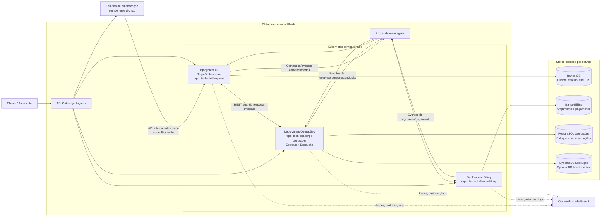

# Diagrama de Componentes — Fase 4

**Status:** Limites/ownership aceitos nos ADR-014/015; orchestrator no OS aceito no ADR-017. Serviços e recursos ainda não foram implementados.

## Ownership representado

| Serviço | Fonte da verdade | Não deve fazer |
|---|---|---|
| OS | Clientes, veículos, filiais, ordens, status geral e histórico; associa filial imutável à OS | Escrever em Billing/Operações ou consultar diretamente os bancos deles |
| Billing | Orçamentos, aprovações, pagamentos e referências do Mercado Pago; preserva `filialId` para auditoria/relatórios | Alterar OS/estoque diretamente ou tratar snapshot de cliente como cadastro mestre |
| Operações | PostgreSQL: peças, saldos, reservas e movimentações por `(filialId, pecaId)`. DynamoDB: fila/dossiê de execução e diagnóstico | Usar saldo de outra filial sem transferência explícita, duplicar saldo no DynamoDB, alterar estado geral da OS ou manter cópia de orçamento/pagamento |

Cluster, rede, API Gateway, broker e observabilidade são plataforma compartilhada, não recursos físicos exclusivos por serviço. Cada serviço possui repositório, banco gerenciado fisicamente dedicado, manifests, permissões e deploy independentes. A Lambda é componente técnico e consulta dados de cliente pela API interna do OS, sem conexão ao banco. Ver [ADR-015](../adr/ADR-015-ownership-e-infraestrutura-fase4.md).