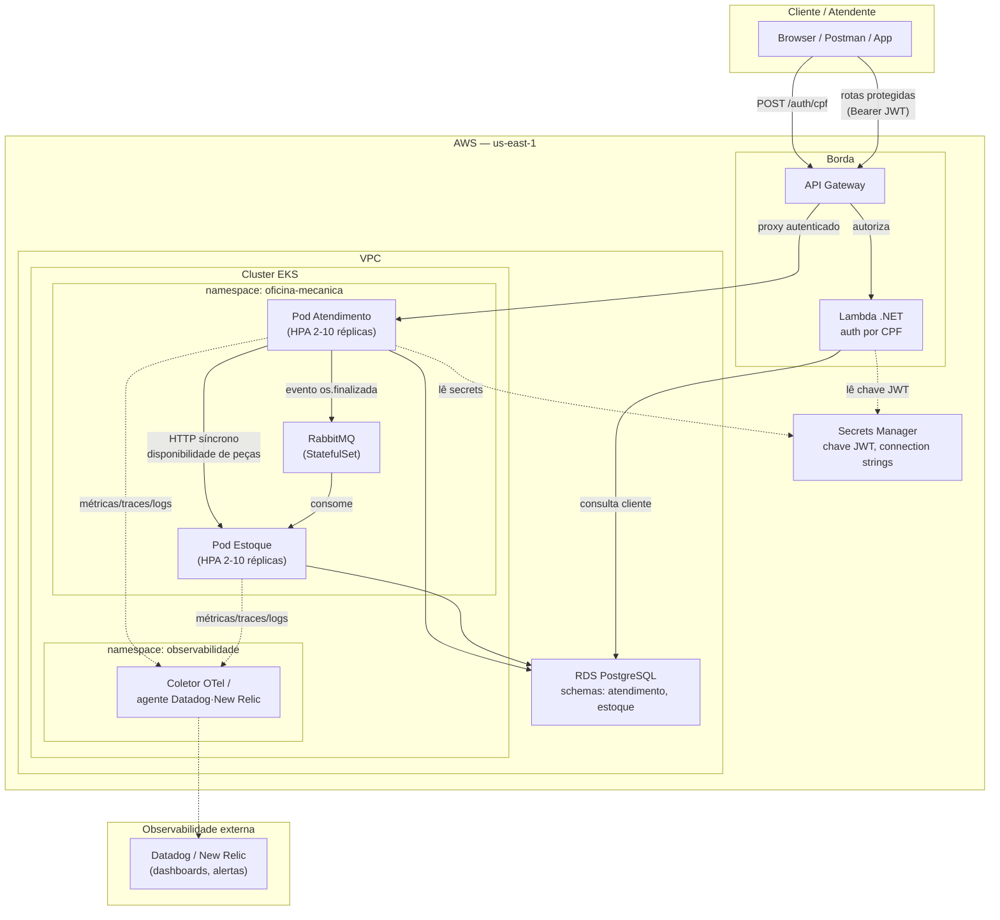

# Diagrama de Componentes — Fase 3

Visão de nuvem, APIs, banco de dados e monitoramento após a migração para AWS ([ADR-009](../adr/ADR-009-migracao-aws-e-separacao-repositorios.md)).

## Componentes

| Componente | Responsabilidade |
|---|---|
| API Gateway | Roteamento e controle de acesso — rotas sensíveis exigem JWT válido |
| Lambda (auth por CPF) | Valida CPF, consulta cliente no RDS, emite JWT |
| Cluster EKS | Executa Atendimento e Estoque com HPA (2-10 réplicas) |
| RDS PostgreSQL | Banco gerenciado, schemas `atendimento` e `estoque` (ADR-007) |
| RabbitMQ | Mensageria assíncrona para baixa de estoque (ADR-001) |
| Secrets Manager | Chave JWT e connection strings, sem credenciais hardcoded |
| Datadog / New Relic | Observabilidade corporativa — dashboards e alertas (CARD-31) |

Ver também [Diagrama de Sequência — Autenticação via CPF](diagrama-sequencia-autenticacao.md).
