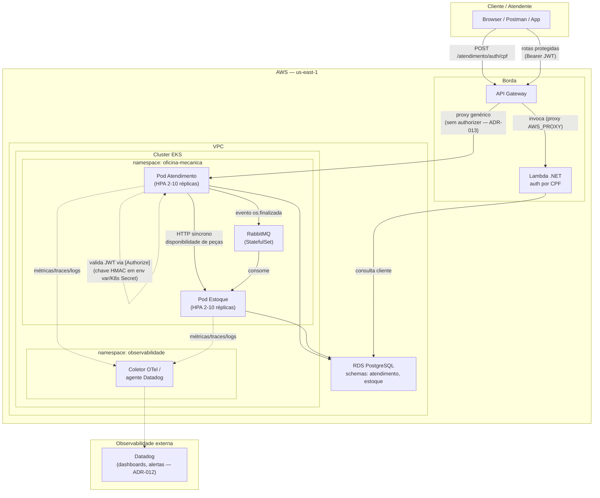

# Diagrama de Componentes — Fase 3

Visão de nuvem, APIs, banco de dados e monitoramento após a migração para AWS ([ADR-009](../adr/ADR-009-migracao-aws-e-separacao-repositorios.md)).

## Componentes

| Componente | Responsabilidade |
|---|---|
| API Gateway | Proxy genérico para o ALB do EKS + rota de autenticação para a Lambda (sem authorizer na borda — [ADR-013](../adr/ADR-013-autenticacao-authorize-aspnet-nao-api-gateway.md)) |
| Lambda (auth por CPF) | Valida CPF, consulta cliente no RDS, emite JWT (HMAC-SHA256) |
| Cluster EKS | Executa Atendimento e Estoque com HPA (2-10 réplicas) |
| RDS PostgreSQL | Banco gerenciado, schemas `atendimento` e `estoque` (ADR-007) |
| RabbitMQ | Mensageria assíncrona para baixa de estoque (ADR-001) |
| Atendimento (`[Authorize]`) | Valida o JWT nas rotas sensíveis, incluindo `/ordens-servico/acompanhar/{numero}` — [ADR-013](../adr/ADR-013-autenticacao-authorize-aspnet-nao-api-gateway.md) |
| Datadog | Observabilidade corporativa — dashboards e alertas ([ADR-012](../adr/ADR-012-observabilidade-corporativa-datadog.md), CARD-31) |

Ver também [Diagrama de Sequência — Autenticação via CPF](diagrama-sequencia-autenticacao.md).
