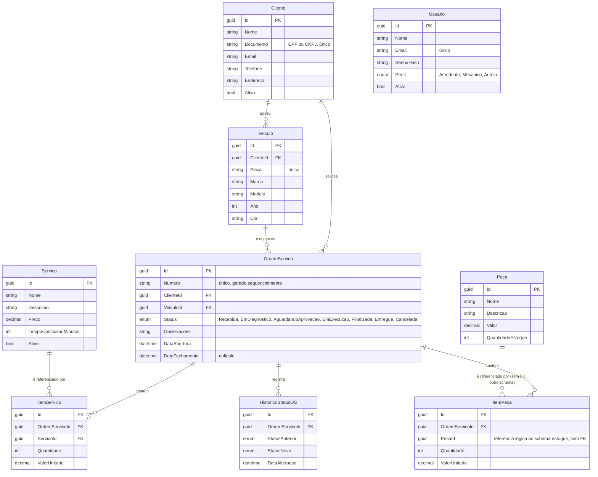

# Diagrama de Entidade-Relacionamento

Banco único (RDS PostgreSQL) com dois schemas separados por bounded context, conforme [ADR-007](../adr/ADR-007-banco-compartilhado-schemas-separados.md). Não há foreign key entre schemas — `estoque.Pecas` é referenciada por `atendimento.ItensPeca.PecaId` apenas por convenção de ID, sem constraint, porque cada schema pertence a um serviço diferente (ver [ADR-004](../adr/ADR-004-estoque-fonte-verdade-pecas.md)).

## Schemas

| Schema | Tabelas | Serviço dono |
|---|---|---|
| `atendimento` | Cliente, Veiculo, OrdemServico, ItemServico, ItemPeca, HistoricoStatusOS, Servico, Usuario | Atendimento |
| `estoque` | Peca | Estoque |

## Relacionamentos e regras de negócio

- **Cliente → Veiculo**: um cliente pode ter vários veículos; um veículo pertence a exatamente um cliente. A abertura de uma OS valida que o veículo informado pertence ao cliente informado (`AbrirOrdemServicoUseCase`).
- **OrdemServico → ItemServico / ItemPeca**: uma OS agrega os serviços e peças usados no atendimento. `ValorTotal` da OS é calculado (não persistido) como a soma dos itens.
- **OrdemServico → HistoricoStatusOS**: cada transição de status gera um registro de histórico, incluindo status anterior e novo — auditoria completa do ciclo de vida da OS (ver [ADR-002](../adr/ADR-002-observabilidade-falhas-tabela-banco.md)).
- **ItemPeca → Peca (schema estoque)**: intencionalmente **sem foreign key** — `PecaId` é uma referência lógica resolvida via chamada HTTP síncrona (verificação de disponibilidade, na abertura) e evento assíncrono (baixa de estoque, na finalização), nunca via JOIN direto entre schemas. Essa é a fronteira do bounded context: o Atendimento não é dono do dado de peça, apenas referencia seu ID.
- **Usuario**: não tem relacionamento com as demais entidades — é o cadastro de login interno (atendentes/mecânicos/admin), independente do fluxo de Cliente (que se autentica via CPF, [RFC-003](../rfcs/RFC-003-estrategia-de-autenticacao.md)).

Ver também [Diagrama de Sequência — Abertura e Finalização de OS](diagrama-sequencia-abertura-os.md).
