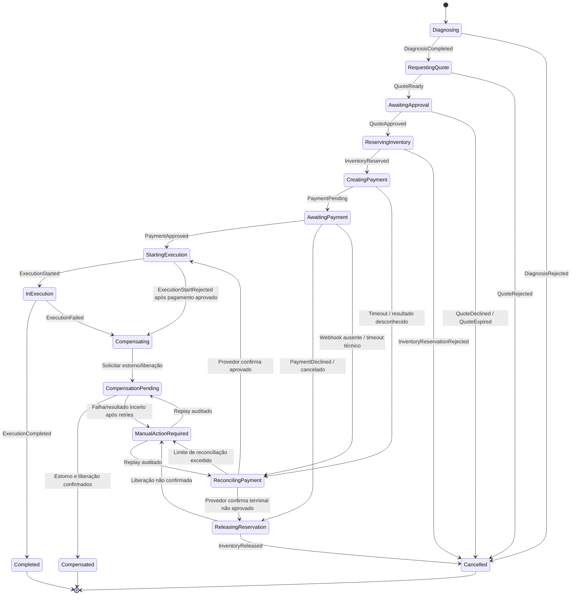

# Estados — Saga da OS na Fase 4

**Estados aprovados** para a orquestração descrita no ADR-017 (aceito).

`ManualActionRequired` só sai por ação auditada ou reconciliação que determine um resultado seguro; replay não pode duplicar efeitos já confirmados. No MVP, as transições de replay auditado não são implementadas: o estado é persistido e alertado, e a saída é manual (ADR-017, Escopo do MVP).