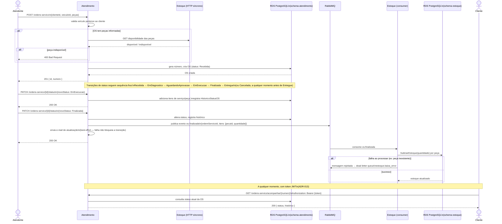

# Diagrama de Sequência — Abertura e Finalização de Ordem de Serviço

Fluxo desde a abertura da OS pelo atendente até a baixa de estoque assíncrona ao finalizar, conforme [ADR-001](../adr/ADR-001-arquitetura-microservicos-mensageria.md) (mensageria entre Atendimento e Estoque) e [ADR-004](../adr/ADR-004-estoque-fonte-verdade-pecas.md) (Estoque como fonte de verdade de peças).

## Notas

- A verificação de disponibilidade de peças é **síncrona** (chamada HTTP do Atendimento ao Estoque) — acontece na abertura da OS, antes de persistir, para não criar uma OS que não pode ser atendida.
- A baixa efetiva do estoque é **assíncrona** (evento `os.finalizada` via RabbitMQ) — só acontece quando a OS é de fato finalizada, não na abertura. Ver [ADR-001](../adr/ADR-001-arquitetura-microservicos-mensageria.md) para o racional dessa separação.
- Falha no consumo do evento (ex: peça removida do catálogo entre a abertura e a finalização) vai para a dead letter queue `estoque.baixa_error`, monitorada pelo alerta descrito em [ADR-012](../adr/ADR-012-observabilidade-corporativa-datadog.md)/CARD-31.
- O envio de e-mail ao cliente a cada mudança de status é *best-effort*: uma falha no SMTP não impede a transição de status de ser persistida.
- A transição de status é uma máquina de estados linear (`OrdemServico.AlterarStatus`) — não é possível pular etapas; `Cancelada` é a única exceção, permitida a partir de qualquer status exceto `Entregue`.

Ver também [Diagrama de Componentes](diagrama-componentes.md) e [Diagrama de Sequência — Autenticação via CPF](diagrama-sequencia-autenticacao.md).
