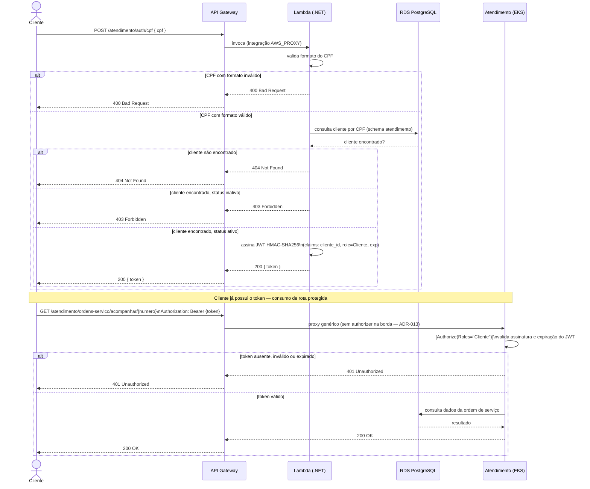

# Diagrama de Sequência — Autenticação via CPF

Fluxo completo desde a submissão do CPF até o consumo de uma rota protegida do Atendimento, conforme [RFC-003](../rfcs/RFC-003-estrategia-de-autenticacao.md) e [ADR-013](../adr/ADR-013-autenticacao-authorize-aspnet-nao-api-gateway.md).

## Notas

- O JWT emitido pela Lambda usa a **mesma chave HMAC-SHA256** já usada pelo Atendimento para validar tokens do fluxo interno (login de atendentes/mecânicos) — um único middleware de validação (`[Authorize]` do ASP.NET Core), independente de qual fluxo emitiu o token.
- A validação de assinatura/expiração do token acontece **dentro do Atendimento** (`[Authorize(Roles="Cliente")]`), não no API Gateway — decisão registrada em [ADR-013](../adr/ADR-013-autenticacao-authorize-aspnet-nao-api-gateway.md). O API Gateway faz apenas proxy genérico (`ANY /{proxy+}`) para o ALB do EKS.
- A rota `GET /ordens-servico/acompanhar/{numero}` **exige** JWT válido com role `Cliente` — não é mais uma rota pública (mudança em relação ao desenho original do CARD-30).

Ver também [Diagrama de Componentes](diagrama-componentes.md).
