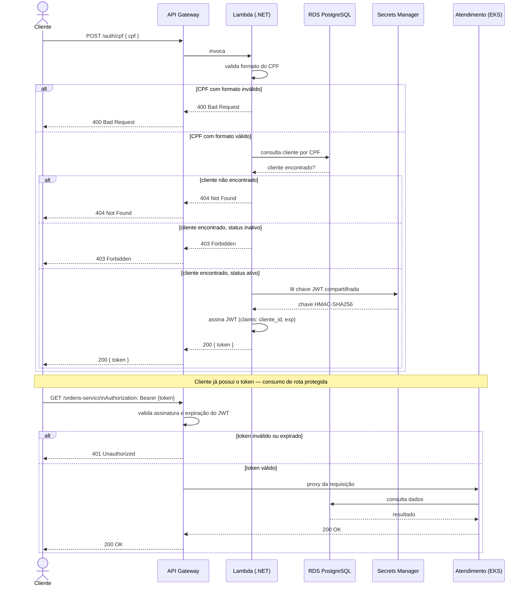

# Diagrama de Sequência — Autenticação via CPF

Fluxo completo desde a submissão do CPF até o consumo de uma rota protegida do Atendimento, conforme [RFC-003](../rfcs/RFC-003-estrategia-de-autenticacao.md).

## Notas

- O JWT emitido pela Lambda usa a **mesma chave** já usada pelo Atendimento para validar tokens do fluxo interno (login de atendentes/mecânicos) — um único middleware de validação, independente de qual fluxo emitiu o token.
- A validação de assinatura/expiração do token nas rotas protegidas acontece no **API Gateway** (authorizer), antes de a requisição alcançar o pod do Atendimento — uma requisição com token inválido nunca chega ao cluster.
- Rotas públicas (ex: `GET /ordens-servico/acompanhar/{numero}`) não passam pelo authorizer — ver [CARD-30](../cards/05-fase3-aws/CARD-30-api-gateway-integracao.md).

Ver também [Diagrama de Componentes](diagrama-componentes.md).
